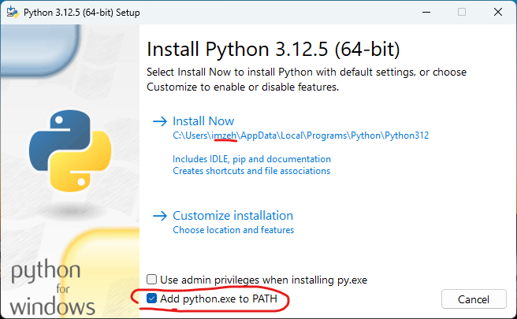
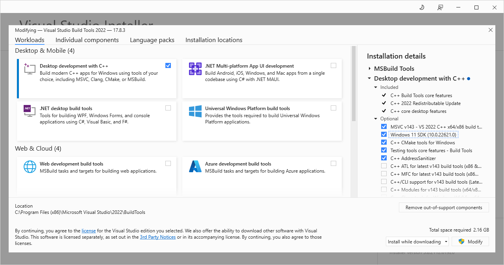

# :fontawesome-solid-computer: Install

A list of software to install

## :simple-python: Python

<!-- prettier-ignore -->
1. Go to [Python 3.12.5](https://www.python.org/downloads/release/python-3125/) and download the [Windows installer (64-bit)](https://www.python.org/ftp/python/3.12.5/python-3.12.5-amd64.exe).

2. Execute the installer and make sure to check the box underneath that says **Add python.exe to path**.

    

    !!! note
        If your username contains a space, use a location that doesn't spaces in it.

## :material-microsoft-visual-studio-code: Visual Studio Code

<!-- prettier-ignore -->
1. Go to [Visual Studio Code](https://code.visualstudio.com/) and download [VS Code](https://code.visualstudio.com/sha/download?build=stable&os=win32-x64-user).

2. Select **I accept the agreement** to begin with.

    

3. Check all the boxes in the **Other** section.

    

4. Then **Install**.

    

5. After installation, make sure to install two handy extensions.

    Look for Extensions on the left-hand panel and **Search**

      - python
      - indent-rainbow
      - jupyter

    

    

## :simple-cplusplusbuilder: Microsoft C++ Build Tools

<!-- prettier-ignore -->
1. Go to [Microsoft C++ Build Tools](https://visualstudio.microsoft.com/visual-cpp-build-tools/) and download [Build Tools](https://aka.ms/vs/17/release/vs_BuildTools.exe).

2. Check **Desktop development with C++** then **Install**.

    

## :fontawesome-solid-brain: Prover9-Mace4

<!-- prettier-ignore -->
1. Go to [Prover9-Mace4 v05](https://www.cs.unm.edu/~mccune/prover9/gui/v05.html) and download [installer](https://www.cs.unm.edu/~mccune/prover9/gui/Prover9-Mace4-v05-setup.exe) and [patch](https://www.cs.unm.edu/~mccune/prover9/gui/MSVCP71.DLL) file.

2. Simply click **Next** all the way.

    

3. Then **Install**.

    

4. Copy and paste the patch file to `C:\Program Files (x86)\Prover9-Mace4`.

    

## :simple-git: Git

<!-- prettier-ignore -->
1. Go to [Git - Downloads](https://git-scm.com/downloads) and get [installer](https://github.com/git-for-windows/git/releases/download/v2.44.0.windows.1/Git-2.44.0-64-bit.exe).

2. Simply click **Next** all the way.

    

3. Then **Install**.

    

## :simple-gnometerminal: Windows Terminal

<!-- prettier-ignore -->
1. Open **Microsoft Store** from start menu and look for "Windows Terminal".

    

2. **Get** the application.
